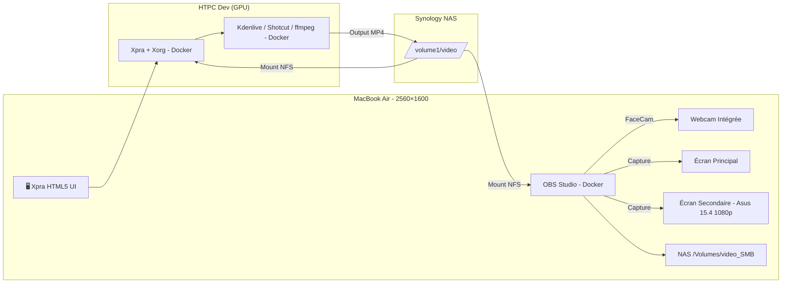

# 🎥 video-pro-stream

**Système complet d'enregistrement et de montage vidéo 100% Dockerisé**, conçu pour les développeurs qui veulent documenter leur travail sans friction.

---

## 📦 Objectifs

- Capturer deux écrans + webcam via OBS (conteneur sur Mac)
- Stockage direct sur NAS via montage SMB/NFS
- Conversion `.mkv` → `.mp4` automatisée
- Montage distant GPU via HTPC avec Xpra + Kdenlive/Shotcut
- Accès au montage via interface HTML5 (navigateur)

---

## ⚙️ Architecture

🔗 [Voir le diagramme interactif](https://vegito-app.github.io/video-pro-stream/)

---

## 🚀 Composants

- `docker-compose.obs.yml` → OBS avec 2 écrans + webcam
- `convert.sh` → conversion `.mkv` vers `.mp4`
- `docker-compose.htpc.yml` → conteneur GPU avec montage HTML5
- `start-xpra.sh` → session Xpra autonome avec Kdenlive

---

## 🔗 Liens utiles

- 🧠 GitHub Pages : [vegito-app.github.io/video-pro-stream](https://vegito-app.github.io/video-pro-stream/)
- 📦 Dépôt principal : [`vegito-app/video-pro-stream`](https://github.com/vegito-app/video-pro-stream)

---

## 🛠️ Licence

MIT — Reprenez le contrôle sur votre flux de travail créatif.
